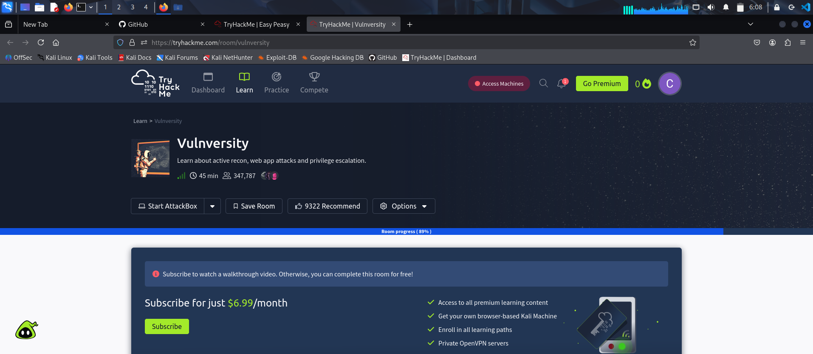
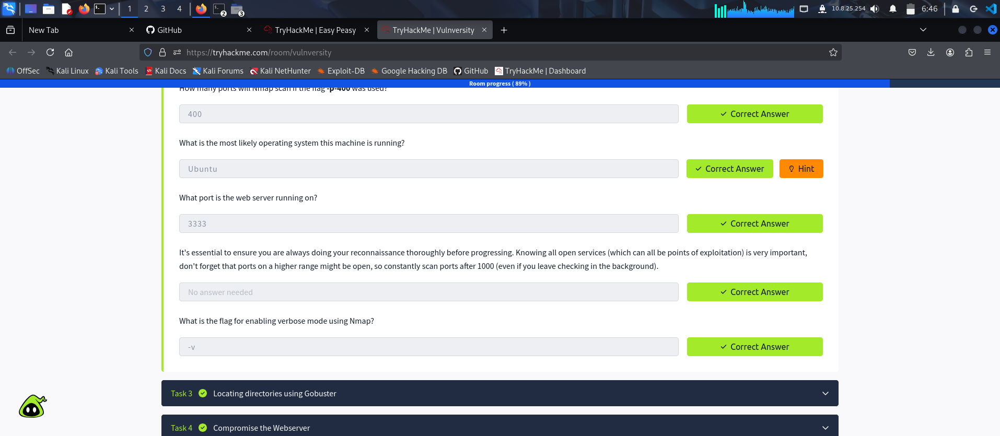
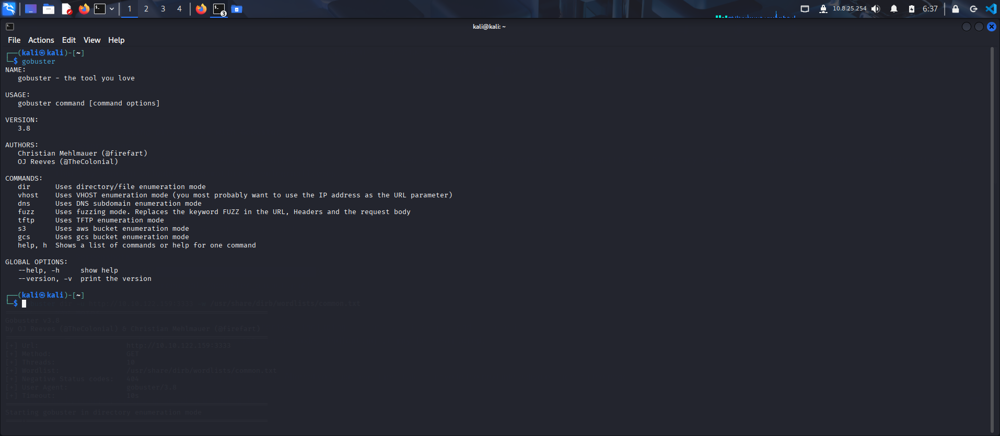
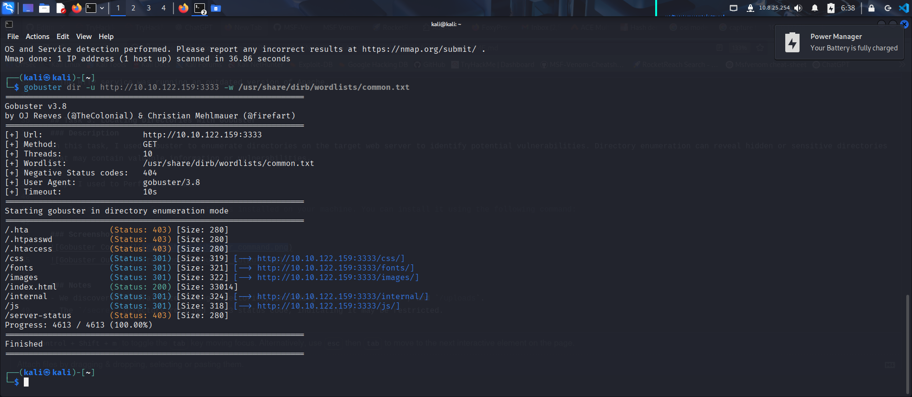
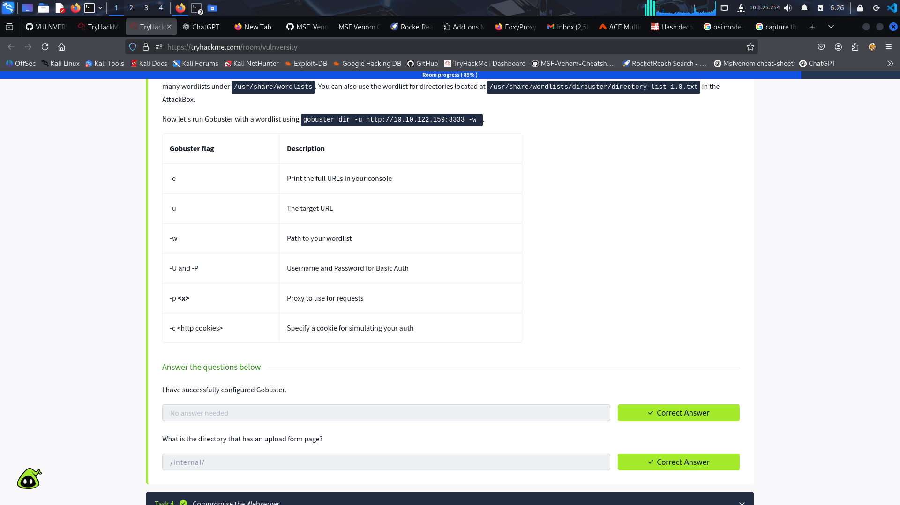

# VULNVERSITY-LAB-DOCUMENTATION
# Vulnversity Lab Documentation

## Task 2: Reconnaissance 
### Description
In this task, we performed enumeration to identify potential vulnerabilities on the target system.

### Screenshots

- So basically we need to scan for open ports using the NMAP scan as shown in the screenshot. Though most times adviceable to run the to scan aggressively using nmap -A and IP address.
- After that we scanned for the service version using nmap -sV and IP address

This is the vunlversity lab where you get to first turn on your machine and connect to your OPENVPN. 

These are the answers I got after scanning for open ports and the service versions as shown on the first screenshot

### Notes
- Nmap revealed several open ports, including SSH and HTTP.
- The HTTP service was running an outdated version of Apache.

## Task 3: Locating Directories with Gobuster
### Description
In this task, I used Gobuster to enumerate directories on the target web server to identify potential vulnerabilities. Directory enumeration can reveal hidden or sensitive directories that may contain valuable information or vulnerabilities.

Steps I used to Perform the Task:

Install Gobuster: Ensure Gobuster is installed on your machine. You can install it using the following command:
    
    sudo apt-get install gobuster.

Run Gobuster: Use Gobuster to scan for directories on the target web server. Using: 
    
    gobuster dir -u http://10.10.122.159:3333 -w /usr/share/dirb/wordlists/common.txt
    
       
 -u: Specifies the target URL.

 -w: Specifies the wordlist to use.

### Screenshots

Analyze the Results: Review the output from Gobuster to identify any interesting directories. Take note of any directories that seem sensitive or out of the ordinary. Which brings us to answering the question on this task 3:

 

Here is the upload form page when you open the internal directory on your terminal

### Notes
- We discovered several interesting directories, including `/admin`, `/backup`, and `/uploads`.
- The `/secret` directory returned a 403 status code, indicating it may be restricted.

