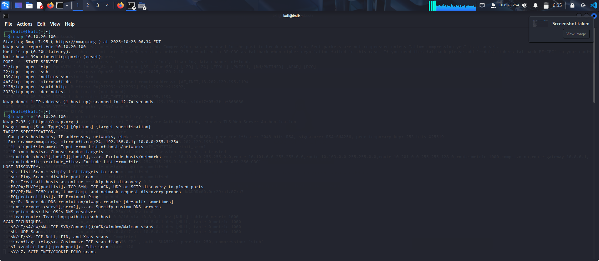
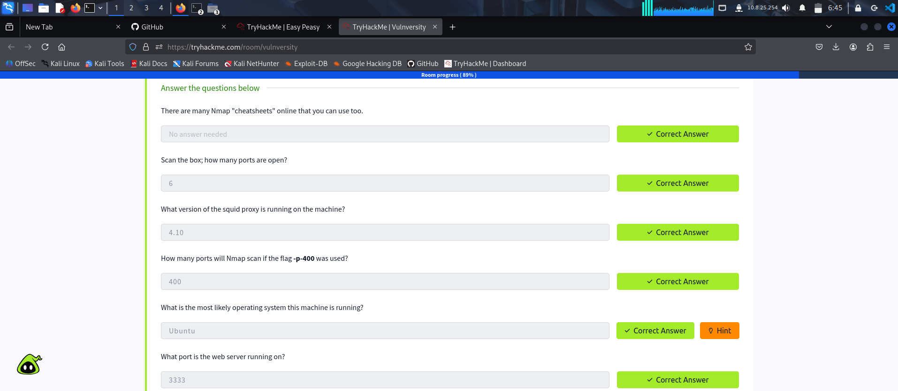

# VULNVERSITY-LAB-DOCUMENTATION
# Vulnversity Lab Documentation

## Task 1: Enumeration
### Description
In this task, we performed enumeration to identify potential vulnerabilities on the target system.

### Screenshots

- So basically we need to scan for open ports using the NMAP scan as shown in the screenshot. Though most times adviceable to run the to scan aggressively using nmap -A and IP address.
- After that we scanned for the service version using nmap -sV and IP address

### Notes
- Nmap revealed several open ports, including SSH and HTTP.
- The HTTP service was running an outdated version of Apache.

## Task 2: Exploitation
### Description
This task involved exploiting a known vulnerability to gain access to the system.

### Screenshots

### Notes
- We used an exploit for a known Apache vulnerability.
- Gained a shell on the target system.
